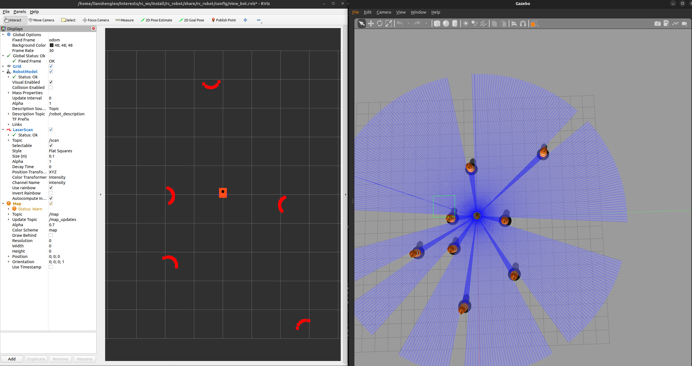
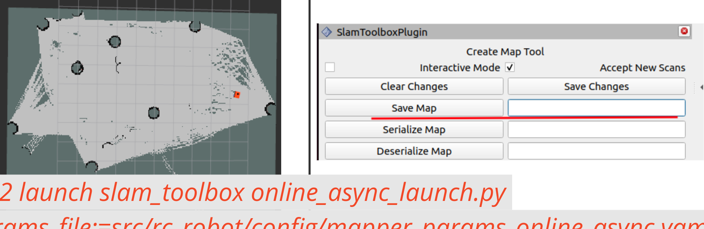
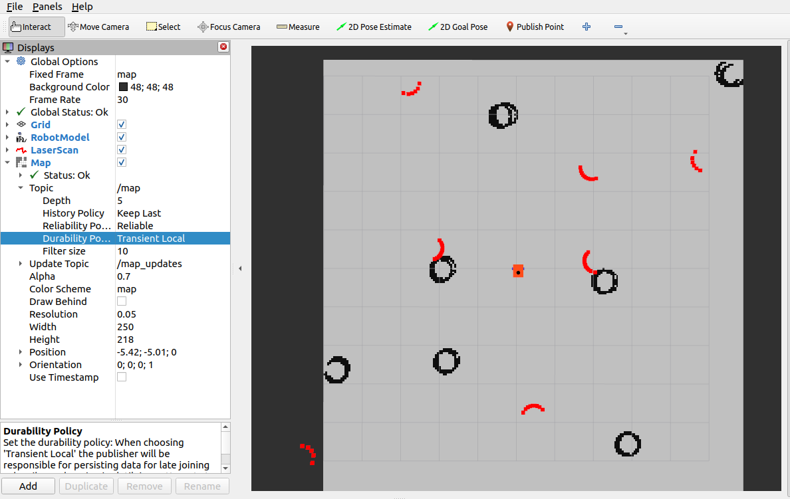
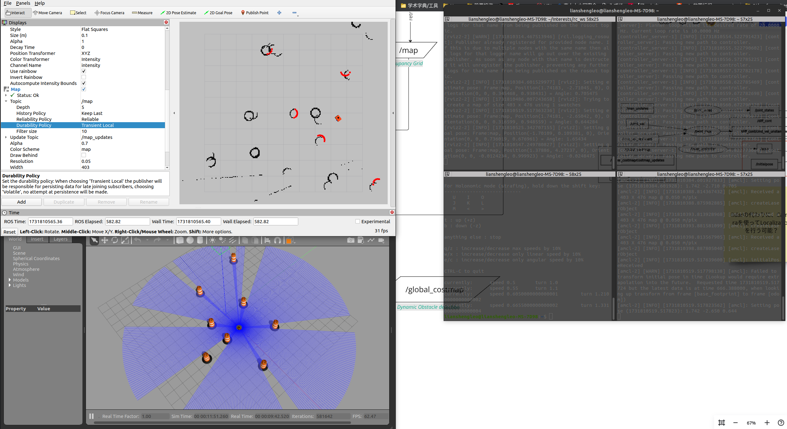

## RC_bot for Navigation2

Navigation 2 implementation on rc_bot, this is the hands-on for understanding better the process of turning a robot to be capable of Nav2 from Scratch (i.e., from URDF).

### Todo

- [ ]  copy nav2_bringup `localization_launch.py` and `navigation_launch.py` and their respective 
- [ ]  Working on real robot
  - [ ] Sub-task or description  


## Setting working dir
check [this template](https://github.com/joshnewans/my_bot) for setting up the DIR, including
`config`, `description`, `launch`, `worlds` folders

### 1. Create a rc_ws, clone & build this repo
```bash
mkdir -p ~/rc_ws/src
cd rc_ws/src && git clone https://github.com/lianshengleo27/rc_robot.git
```
### 2. Installation depenencies
in `rc-ws` dirctory
```bash
sudo apt update
rosdep install -i --from-path src --rosdistro $ROS_DISTRO -y
```
### 3. Build the package
in `rc-ws` dirctory
```bash
colcon build --symlink-install
```

## :star2: Start Gazebo simulation
in `rc-ws` dirctory
```bash
source install/setup.bash
ros2 launch rc_robot launch_sim.launch.py
```
This starts the gazebo `obstable.worlds`



## SLAM (ONLY if map generation is needed)
### 1. Generating a map by moving around the robot
in `rc-ws` dirctory
```bash
ros2 launch slam_toolbox online_async_launch.py param_file:=~/Interests/rc_ws/src/rc_robot/config/mapper_params_online_async.yaml
```
> `mapper_params_online_async.yaml` defines the parameters for `slam_toolbox`. You can modify it to change the behavior of SLAM, such as changing the map resolution or scan topics.
```yaml
    odom_frame: odom
    map_frame: map
    base_frame: base_footprint
    scan_topic: /scan
    # scan_topic: /laser_controller/out
    use_map_saver: true
    mode: mapping #localization
```
### 2. Save the map



## :star2: Localization (AMCL)
localization continuously refines the robot's pose within the map. This is crucial for accurate navigation, especially in dynamic environments where the robot's pose may drift over time. Here is the step for launching localization node:

```bash
ros2 launch nav2_bringup localization_launch.py map:=/path/to/map.yaml use_sim_time:=true
```

<p> :bangbang: After launch, map might not be loaded successfully, do </p>

- Fixed frame set to `map` (typing maunally)
- Give the initial pose in Rviz (:bangbang: + direction is where <b>wheels</b> are positioned )
- Under `Map` >> `Topic` section in Rviz, set Durability to `transient_local`
<br><br>



## :star2: Navigation
Once launching the localization, you can start navigation
```bash
ros2 launch nav2_bringup navigation_launch.py use_sim_time:=true map_subscribe_transient_local:=true
```


